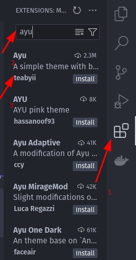

# Setup de Ferramentas

Os exercícios abaixo têm o intuito de fixar o que foi visto em aula, como os comandos usados em um terminal. Em meio a isso, eles vão ajudá-lo a preparar o que será seu grande companheiro para o resto da vida: seu ambiente de desenvolvimento.

  
Exercício 1

  <h3>Criando uma pasta pelo terminal</h3>

Vamos criar uma pasta para que possamos guardar nosso primeiro projeto. Mas vamos tentar fazer isso de uma maneira diferente: usando comandos do terminal. Para isso:

- Abra o terminal (Dica: use o Git Bash)
- Navegue até a área de trabalho usando o comando <code>cd</code>
- Crie uma pasta chamada <i>exercicio setup</i> usando com o comando <code>mkdir</code>

  
Exercício 2

  <h3>Clonando um repositório do GitHub</h3>

Caso tenha tido dificuldades em criar a pasta <i>exercicio setup</i> usando o terminal, sem problema algum. Faça a criação da maneira convencional mesmo, usando a interface gráfica.
Com a pasta <i>exercicio setup</i> criada, vamos clonar este repositório dentro dela. Para isso:

- Clique em <i>Code</i> (botão verde) no GitHub

  

- Selecione a opção <i>SSH</i> (você deve ter configurado a chave SSH. Caso não tenha, reveja a aula) e copie o link do clone

  

- Navegue até a pasta criada usando o Git Bash
- Use o comando <code>git clone</code> com o link que copiou anteriormente

  
Exercício 3

  <h3>Abrindo o projeto no VS Code</h3>

Abra o projeto clonado no VS Code. Para isso:

- Abra o VS Code
- Vá até <i>Arquivo (File, em inglês)</i>, no menu superior, e clique em <i>Abrir pasta (Open Folder, em inglês)</i>

  

- Selecione a pasta onde clonou o repositório e clique em <i>Abrir</i>

  
Exercício 4

  <h3>Mude o tema do VS Code</h3>

Agora vamos fazer algo que, muito provavelmente, você fará o resto da vida: escolher nosso tema do VS Code!

Acreditem em mim quando eu digo que não importa o tema que escolher agora, uma hora ou outra você vai querer mudá-lo. Temas do VS Code são iguais peça de roupa: você pode gostar de uma, mas uma hora ou outra vai querer trocar.

Alguns dos temas mais famosos usados no Visual Studio Code (VS Code) são

- Monokai (tema escuro)
- One Dark Pro (tema escuro)
- Dracula Theme (tema escuro)
- Noctis (tema claro)
- Ayu (tema claro)

Com exceção do tema Monokai, que vem por padrão (**não precisa ser instalado**), vamos instalar os demais temas. Para isso

- Clique em <i>extensões</i> no menu lateral esquedo e digite o nome do tema

- Instale o tema selecionando-o e clicando em <i>instalar</i>

Para que possamos testar os temas de uma maneira melhor foram criados alguns arquivos e pastas. Abra o arquivo chamado <i>primeiroCodigo.js</i> dando um duplo clique nele no menu lateral esquerdo. Esse arquivo contém um monte de código que não precisamos entender agora. Eles só servem para que possamos ver um código JavaScript em um determinado tema.

Agora, para testar os temas:

- Clique em <i>Configurações (Manage, em inglês)</i> (ícone de engrenagem) no menu lateral esquerdo
- <i>Temas (Themes, em inglês)</i> e depois em <i>Tema de Cores (Color Theme, em inglês)</i>

- Basta agora clicar na "Setinha para baixo" no seu teclado para ir mudando os temas

- Selecione o que mais gosta

Fique à vontade para entrar no Google e buscar por outros temas muito usados.
Se quiser também, pode ir em extensões e desinstalar os temas que não quiser usar. O processo de desistalação é o mesmo de instalação.

  
Exercício 5

  <h3>Mude o tema de ícones do VS Code</h3>

Veja que as pastas ficam um pouco confusas (pelo menos pra mim) no tema de ícones padrão do VS Code. Para mudá-lo, vamos instalar o tema de ícones mais famoso. Para isso:

- Vá até <i>extensões</i> no menu lateral esquerdo
- Procure a extensão chamada Material Icon Theme
- Instale-a

O processo de selecionar o tema de arquivos é o mesmo de selecionar o tema:

- Clique em <i>Configurações (Manage, em inglês)</i> (ícone de engrenagem) no menu lateral esquerdo
- <i>Temas (Themes, em inglês)</i> e depois em <i>Tema de Arquivos (File Icons Theme, em inglês)</i>

